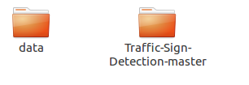

# Red-Traffic-Sign-Detection
This is a project to detect the red round traffic signs. 

I am going to use YOLO3, Fast-RCNN  to do that. More Networks will be tried after the final examination.

## How to run this project?

1. Git clone this project 

```
git clone https://github.com/jiegenghua/Traffic-Sign-Objection.git
```

2.  Download dataset and put it in the same folder with this project. There are 3 folders whose name are "train", "test", "other"  and a 'Annotation.json' file after you unzip it.
```
   mkdir data
   wget http://cg.cs.tsinghua.edu.cn/traffic-sign/data_model_code/data.zip
   wget http://cg.cs.tsinghua.edu.cn/traffic-sign/data_model_code/code.zip
   unzip data.zip
   unzip code.zip
```


3. Extract data from Annotation.json and put them into .csv file
```
cd Traffic-Sign-Detection-master
python dataextract.py
```
4. Preprocessing data including crop and relabel to prepare it for CNN
```
python datapreprecessing
```
5. Do some statistic analysis
```
python stats.py
```
6. Train and test using CNN method
```
python train_test.py
```
7. YOLOv3- tensorflow. It can work, but you have to do some data preprocessing work. Will fix it later.
```
git clone https://github.com/YunYang1994/tensorflow-yolov3.git
```
8. Convert to tfrecord, which is the form yolov3-tensorflow can accept
```
python TT100K2TFRecord.py
python convert_tfrecord.py
```
